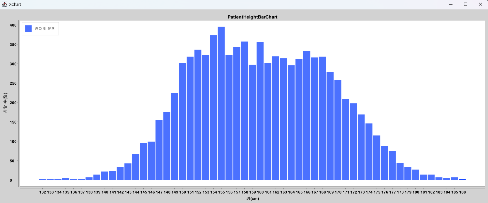
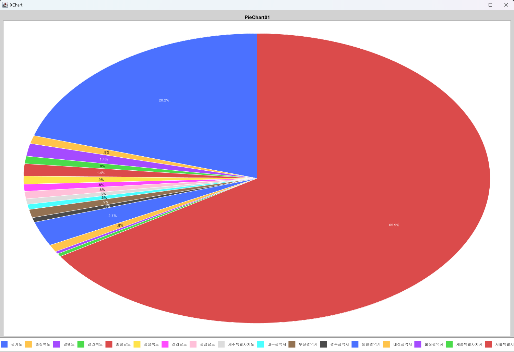
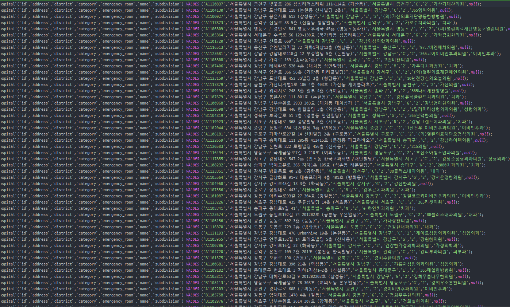

# 멋쟁이사자처럼 백엔드 스쿨 2기

## 주차별 학습 내용
|  주차   |                 수업 내용                 |   특강  |
|:-----:|:-------------------------------------:|:-----:|
|  1주차  |                Java 기초                |       |
|  2주차  |                Java 기초                |       |
|  3주차  |             Git, Java 응용              |       |
|  4주차  |               DB입문, AWS               | 도메인특강 |
|  5주차  | HTML, CSS, JavaScript, DB입문, Spring입문 |  |

---

## 수행 프로젝트 목록
### 1. 알고리즘 구현
1. Stack 자료구조 구현하기(테스트 코드 작성)
2. [삽입정렬](https://github.com/wogus0518/LikeLion-Backend/blob/main/do-in-class/src/main/week4/date221014/InsertionSortEx.java)
3. [선택정렬](https://github.com/wogus0518/LikeLion-Backend/blob/main/do-in-class/src/main/week4/date221013/algorithm/SelectionSortEx.java)

### 2. 콘솔 게임 만들기
1. 가위바위보 게임
2. Up & Down 숫자 게임

### 3. 대용량 파일 처리 프로젝트
1. [환자 데이터를 이용해 키 분포 시각화](https://github.com/wogus0518/LikeLion-Backend/tree/main/do-in-class/src/main/week3/date221007/miniProject)
2. [대한민국 전출입 공공데이터를 이용해 서울에서 전출간 지역 비율 시각화](https://github.com/wogus0518/LikeLion-Backend/tree/main/do-in-class/src/main/week3/date221007/miniProject)
3. [병원 정보 공공데이터 파일을 읽은 후 필요한 정보를 DB에 넣기 위해 `.sql` 파일 생성하기](https://github.com/wogus0518/likelion-gradle-01)

### 4. AWS
1. EC2 인스턴스에서 Docker를 이용해 MySQL 사용하기

### 5. SpringBoot 프로젝트
1. [토비의 스프링3-1](https://github.com/wogus0518/likelion-spring)

---

## 주요 프로젝트 결과물
#### 1. 환자 키 분포 시각화 

#### 2. 서울 전출입 비율 시각화 

#### 3. 공공데이터에서 필요한 정보만을 추출한 후 .sql 파일 생성 

